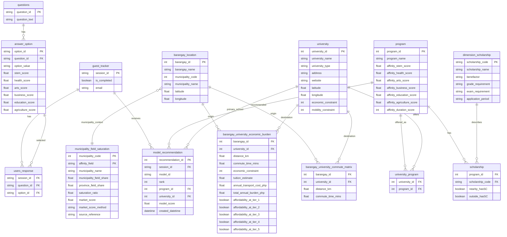

# GabayPoz Recommender v1.1 Proposed ERD

| Item                   | Value                                        |
| ---------------------- | -------------------------------------------- |
| Document ID            | `team4_recommender_v1_1_erd`                 |
| Model ID               | `tds_recommender_v1_1`                       |
| Status                 | Generated handoff ERD for Team 5 integration |
| Generated datasets     | `data/processed/team4_model/`                |
| Local Supabase exports | `data/raw/supabase_exports/`                 |

## Summary

This ERD supports the v1.1 program-first recommender:

1. Validate a completed student session.
2. Read questionnaire answers and scoring rows.
3. Score programs using six affinity dimensions plus municipality saturation context.
4. Filter school suggestions using barangay-to-university commute and affordability burden.
5. Persist exactly three primary program rows to `model_recommendation`.
6. Return explanations and alternate schools through the API response, not through v1.1 persistence.

## Implemented / Generated

| Item                          | Status      | Evidence                                                                 |
| ----------------------------- | ----------- | ------------------------------------------------------------------------ |
| ERD document                  | Generated   | `docs/reports/model/team4_recommender_v1_1_erd.md`                       |
| ID-keyed barangay location    | Generated   | `data/processed/team4_model/barangay_location.parquet`                   |
| ID-keyed university table     | Generated   | `data/processed/team4_model/university.parquet`                          |
| ID-keyed commute matrix       | Generated   | `data/processed/team4_model/barangay_university_commute_matrix.parquet`  |
| ID-keyed burden table         | Generated   | `data/processed/team4_model/barangay_university_economic_burden.parquet` |
| Municipality saturation table | Generated   | `data/processed/team4_model/municipality_field_saturation.parquet`       |
| Dataset manifest              | Generated   | `data/processed/team4_model/dataset_manifest_v1_1.json`                  |
| Recommender module            | Implemented | `analysis/team4_model/recommender_v1_1.py` and packaged mirror in `dist` |

## Proposed ERD

## Keys And Constraints

| Table                                 | Primary key                                          | Important foreign keys / unique constraints                                                                              |
| ------------------------------------- | ---------------------------------------------------- | ------------------------------------------------------------------------------------------------------------------------ |
| `guest_tracker`                       | `session_id`                                         | `is_completed = true` required before recommendation                                                                     |
| `users_response`                      | proposed composite: `session_id`, `question_id`      | `session_id -> guest_tracker.session_id`; `question_id -> questions.question_id`; `option_id -> answer_option.option_id` |
| `questions`                           | `question_id`                                        | Question text and grouping metadata                                                                                      |
| `answer_option`                       | `option_id`                                          | Option-level scoring rows; needed because answer scoring must be unambiguous                                             |
| `barangay_location`                   | `barangay_id`                                        | `municipality_code` joins market context                                                                                 |
| `university`                          | `university_id`                                      | Names retained for display/audit only                                                                                    |
| `barangay_university_commute_matrix`  | composite: `barangay_id`, `university_id`            | Complete 34 x 20 matrix for Q11                                                                                          |
| `barangay_university_economic_burden` | composite: `barangay_id`, `university_id`            | Complete 34 x 20 matrix for Q10                                                                                          |
| `municipality_field_saturation`       | composite: `municipality_code`, `affinity_field`     | `market_score` must be normalized to 0.0-1.0                                                                             |
| `program`                             | `program_id`                                         | Six affinity score columns and `affinity_duration_score` required                                                        |
| `university_program`                  | proposed composite: `university_id`, `program_id`    | Defines school options for each program                                                                                  |
| `scholarship`                         | proposed composite: `program_id`, `scholarship_code` | `scholarship_code -> dimension_scholarship.scholarship_code`                                                             |
| `model_recommendation`                | `recommendation_id`                                  | Unique recommended rows by `session_id`, `model_id`, `rank`; rank must be 1, 2, 3                                        |

## Generated Dataset Handoff

The following files were generated from Team 3/raw sources:

| Dataset                                                                           | Rows | Purpose                                                      |
| --------------------------------------------------------------------------------- | ----:| ------------------------------------------------------------ |
| `data/processed/team4_model/barangay_location.parquet` / `.csv`                   | 34   | Barangay IDs and coordinates                                 |
| `data/processed/team4_model/university.parquet` / `.csv`                          | 20   | University IDs, metadata, coordinates, cost/mobility classes |
| `data/processed/team4_model/barangay_university_commute_matrix.parquet` / `.csv`  | 680  | Q11 commute filtering                                        |
| `data/processed/team4_model/barangay_university_economic_burden.parquet` / `.csv` | 680  | Q10 affordability filtering                                  |
| `data/processed/team4_model/municipality_field_saturation.parquet` / `.csv`       | 6    | Municipality field saturation market context                 |
| `data/processed/team4_model/dataset_manifest_v1_1.json`                           | 1    | Source paths, schema columns, and validation counts          |

## Local Supabase Export Snapshot

The following raw Supabase tables were exported locally on 2026-05-16 for recommender improvement and demos. Live row counts were also checked against Supabase on 2026-05-16 and match this snapshot, except `local_offering_overrides`, which is a local CSV only and is not currently a Supabase table. The snapshot files are stored under `data/raw/supabase_exports/` and are intentionally unignored so the fork can carry the demo data.

| Export                                                                | Rows   | Notes                                                                        |
| --------------------------------------------------------------------- | ------:| ---------------------------------------------------------------------------- |
| `barangay_location.csv`                                               | 34     | Complete Pozorrubio barangays                                                |
| `university.csv`                                                      | 27     | Includes the newly added schools                                             |
| `program.csv`                                                         | 142    | Supabase program catalog                                                     |
| `university_program.csv`                                              | 530    | Program offerings from Supabase                                              |
| `local_offering_overrides.csv`                                        | 2      | Local demo overrides for PMA Security Studies and MAAP Marine Transportation |
| `barangay_university_commute_matrix.csv`                              | 675    | Incomplete against the 34 x 27 expected full matrix                          |
| `scholarship.csv`                                                     | 2,125  | Program-scholarship bridge rows                                              |
| `dimension_scholarship.csv`                                           | 29     | Scholarship dimension metadata                                               |
| `questions.csv`                                                       | 0      | Needs seeding before end-to-end questionnaire demo                           |
| `answer_option.csv`                                                   | 0      | Needs seeding before option-level scoring demo                               |
| `guest_tracker.csv`, `users_response.csv`, `model_recommendation.csv` | 0 each | No demo sessions/results are persisted yet                                   |

## Finalization Gaps

The core v1.1 recommender logic and local generated handoff datasets are usable, but the live Supabase integration is not yet final. These items must be completed before the recommender can run end to end from Supabase-backed application data.

| Priority | Area                       | Required action                                                                                                                                  | Current gap                                                                                                |
| -------- | -------------------------- | ------------------------------------------------------------------------------------------------------------------------------------------------ | ---------------------------------------------------------------------------------------------------------- |
| Must     | Questionnaire seed data    | Seed `questions` with the final questionnaire IDs and text used by the app flow.                                                                 | `questions` has 0 rows.                                                                                    |
| Must     | Option scoring seed data   | Seed `answer_option` with every option and the six scoring columns: STEM, health, arts, business, education, and agriculture.                    | `answer_option` has 0 rows, so Supabase answers cannot be converted into student affinity scores.          |
| Done     | Commute coverage           | Complete `barangay_university_commute_matrix` for every `barangay_id` x `university_id` pair in the live Supabase launch set.                    | Live Supabase now has 918/918 commute rows.                                                               |
| Must     | Recommendation persistence | Add or map `model_id`, `rank`, and `university_id` in `model_recommendation` so it can store the v1.1 write contract.                            | Current table has only `recommendation_id`, `session_id`, `program_id`, `model_score`, `created_datetime`. |
| Done     | Derived dataset load       | Load `barangay_university_economic_burden` and `municipality_field_saturation` into Supabase.                                         | Live Supabase now has 918/918 burden rows and 6 saturation rows.                                           |
| Should   | Offering overrides         | Move `local_offering_overrides` into Supabase or merge the PMA/MAAP rows into official `university_program` data.                                | Overrides are local CSV data only.                                                                         |
| Should   | End-to-end smoke test      | Create one completed test session, insert `users_response`, run the recommender, persist three ranked rows, and verify returned explanations.    | No demo sessions or persisted recommendations exist yet.                                                   |

Highest-impact commute fixes are the universities with no barangay coverage in the current Supabase snapshot: Maritime Academy of Asia and the Pacific, Pangasinan Merchant Marine Academy, Philippine Military Academy, UP Manila School of Health Sciences - Tarlac, University of the Philippines - Open University, University of Baguio, and University of Cordilleras.

## Supabase Derived Dataset Generation Note

On 2026-05-16, live Supabase schema inspection initially confirmed that `barangay_university_economic_burden` and `municipality_field_saturation` were not present in `public`. A local generation pass produced load-ready files under `/tmp/gabaypoz_supabase_derived/`, and those datasets were then loaded to live Supabase.

| Dataset | Rows | Notes |
| --- | ---:| --- |
| `commute_missing_insert.csv` | 243 | Missing `barangay_id` x `university_id` rows for the live 34 x 27 launch scope |
| `commute_complete_918.csv` | 918 | Existing 675 Supabase commute rows plus 243 generated rows |
| `barangay_university_economic_burden_918.csv` | 918 | Q10 burden rows derived from the complete commute matrix, tuition tier estimates, and v1.1 affordability thresholds |
| `municipality_field_saturation.csv` | 6 | One row per affinity field for Pozorrubio |

Generation assumptions:

- Existing Supabase commute rows remain the source of truth where present.
- Missing commute rows are coordinate-based estimates calibrated against existing Supabase commute rows. The median road-distance multiplier is 1.2389622701602832 and the median minutes-per-km factor is 1.2082551594746718.
- Supabase `university_latitude` and `university_longitude` are currently swapped for populated school coordinates; generation corrected them in memory.
- The UP Open University row has no Supabase coordinates, so generation used an approximate UP Open University Headquarters location in Maahas, Los Banos, Laguna.
- Live Supabase verification after load: `barangay_university_commute_matrix` has 918 rows with 0 missing barangay-university pairs, `barangay_university_economic_burden` has 918 rows with 0 missing pairs, and `municipality_field_saturation` has 6 rows.

## v1.2 Q7 Strand Multiplier Decision

Q7 should be included in recommender v1.2 as a SHS strand aptitude multiplier. This is supported as a methodology move, not as a causal EDA finding: Team 3's questionnaire scoring contract already allows `scoring_type = multiplier`, and the Team 4 model-development notes state that Q7 should multiply matching aptitude dimensions rather than add raw points.

Implementation rule for v1.2:

- `model_id = tds_recommender_v1_2`.
- Q7 is required, but it is not read as an additive row from `questions`.
- Q8 and Q9 are scored normally, normalized as the aptitude vector, then Q7 applies the existing tested v1 multiplier map.
- Unknown Q7 strand values fall back to neutral multipliers and return `UNKNOWN_Q7_STRAND`.
- Supabase can seed/display Q7 immediately, but production scoring needs either `answer_option.scoring_type = multiplier` support or a separate v1.2 scoring contract for Q7.

## Integration Notes

- `model_recommendation.university_id` stores only the primary school suggestion for each recommended program.
- Supabase `model_recommendation` currently lacks `model_id`, `rank`, and `university_id`; those fields must be added or mapped before v1.1 can persist complete recommendation rows.
- Alternate schools and explanation text are returned by the recommender/API response in v1.1 and are not stored in `model_recommendation`.
- Missing `barangay_university_economic_burden` data must block the run with `MISSING_Q10_BURDEN_DATA`.
- Missing saturation data should not block the run; use neutral `market_score = 0.5` and return `MISSING_SATURATION_DATA`.
- `municipality_field_saturation.market_score` is normalized to 0.0-1.0 in the generated dataset.
- Scholarships do not bypass Q10/Q11 feasibility in v1.1; they are returned as context and used only after a school is already feasible.
- Supabase currently has `answer_option` and `users_response.option_id` columns, but both `questions` and `answer_option` exports are empty and must be seeded for real questionnaire scoring.
- PMA and MAAP have local demo offering overrides, but both still need complete barangay commute rows before they can appear in v1.1 school suggestions.
