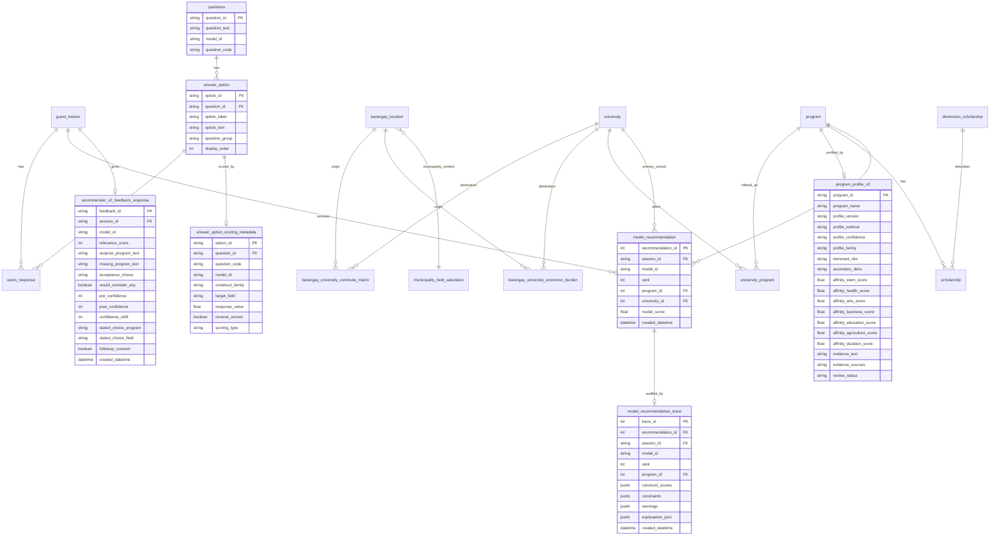

# GabayPoz Recommender v2 Proposed ERD

| Item        | Value                                                         |
| ----------- | ------------------------------------------------------------- |
| Document ID | `team4_recommender_v2_erd`                                    |
| Model ID    | `tds_recommender_v2`                                          |
| Status      | Side-by-side v2 ERD for latent-variable questionnaire scoring |
| Date        | 2026-05-16                                                    |

## Summary

v2 keeps the v1.2 recommendation flow but replaces affinity measurement with construct-tagged Likert items. The final output remains three program-first recommendations in `model_recommendation`; detailed construct scores and explanation evidence move to a separate trace table.

Core changes from v1.2:

- Add v2 question/option rows instead of overwriting v1.2.
- Add option-level scoring metadata for `construct_family`, `target_field`, and `response_value`.
- Add `program_profile_v2` as the authoritative v2 program-environment profile table.
- Add `model_recommendation_trace` for audit and future validation.
- Add `recommender_v2_feedback_response` plus a session-completeness view for pilot evaluation.
- Keep Q10/Q11/Q12 outside the affinity vector.

## Proposed ERD



## v2 Questionnaire Contract

| Question range  | Construct family                            | Target field               | Options                                                     |
| --------------- | ------------------------------------------- | -------------------------- | ----------------------------------------------------------- |
| `V2Q01`-`V2Q24` | `domain_interest` or `domain_self_efficacy` | one of six GabayPoz fields | Likert `1` to `5`                                           |
| `V2Q25`         | `context`                                   | `strand`                   | SHS strand                                                  |
| `V2Q26`         | `constraint`                                | `financial`                | Q10 affordability tier                                      |
| `V2Q27`         | `constraint`                                | `mobility`                 | Q11 commute/dorm tolerance                                  |
| `V2Q28`         | `constraint`                                | `duration`                 | Q12 duration/board-exam tolerance                           |
| `V2Q29`         | `aspiration`                                | `professional_track`       | Q13 post-graduate track (Medicine / Dentistry / Law / None) |

Affinity item response values:

| Stored value | Meaning          |
| ------------:| ---------------- |
| 1            | Not like me      |
| 2            | Slightly like me |
| 3            | Somewhat like me |
| 4            | Very like me     |
| 5            | Strongly like me |

## Keys And Constraints

| Table                            | Key / constraint                                                                                                                                                                                      |
| -------------------------------- | ----------------------------------------------------------------------------------------------------------------------------------------------------------------------------------------------------- |
| `questions`                      | Add or maintain a `model_id`/`question_code` discriminator so v1.2 and v2 rows can coexist.                                                                                                           |
| `answer_option`                  | One row per selectable option; legacy score columns may remain zero for v2 affinity options.                                                                                                          |
| `answer_option_scoring_metadata` | `option_id` primary key; `construct_family` in `domain_interest`, `domain_self_efficacy`, `context`, `constraint`, `aspiration`; `target_field` required; `response_value` required for Likert items. |
| `users_response`                 | Stores selected `option_id`; v2 sessions should select from v2 option rows only.                                                                                                                      |
| `program_profile_v2`             | One row per recommendable program. Six scores must be 0-5, non-missing, and nonzero as a vector. `profile_confidence` and `evidence_text` are required.                                               |
| `model_recommendation`           | Same v1.2 persisted result contract, with `model_id = tds_recommender_v2`.                                                                                                                            |
| `model_recommendation_trace`     | One trace row per persisted recommendation row. Stores construct scores, constraints, warnings, and explanation evidence.                                                                             |
| `recommender_v2_feedback_response` | One feedback row per v2 session/model pair. Stores relevance, acceptance, pre/post confidence, stated-choice ground truth, and follow-up consent without PII.                                         |
| `recommender_v2_session_completeness` | View over questionnaire responses, recommendation trace, and feedback. `session_complete = true` only when a session has 29 v2 responses, at least three trace rows, and one feedback row.          |

## Generated Seed Files

| File                                                                                  | Rows     | Purpose                             |
| ------------------------------------------------------------------------------------- | --------:| ----------------------------------- |
| `data/processed/team4_model/supabase_seed/questions_seed_v2.csv`                      | 29       | v2 question rows                    |
| `data/processed/team4_model/supabase_seed/answer_option_seed_v2.csv`                  | 138      | v2 selectable answer options        |
| `data/processed/team4_model/supabase_seed/answer_option_scoring_metadata_seed_v2.csv` | 138      | v2 latent-variable scoring metadata |
| `data/processed/team4_model/program_profile_v2.csv`                                   | 142      | v2 program-environment profiles     |
| `reports/model/program_profile_v2_review.csv`                                         | variable | profile rows requiring human review |

## Program Profile v2 Contract

`program_profile_v2` is the scientific bridge between the student index and actual degree programs. The student vector should not be matched directly to a degree title; it should be matched to the program's independently constructed environment profile.

Profile construction:

- Start from the existing `program` affinity scores as a prior.
- Apply deterministic program-family templates based on program name/code.
- Attach occupation-bridge evidence from `program_occupation_bridge.parquet` when a safe name match exists.
- Assign `profile_confidence` and `review_status`.

v2 matching formula:

```text
shape_fit = (Pearson correlation(student_vector, program_vector) + 1) / 2
direction_fit = cosine_similarity(student_vector, program_vector)
base_score = 0.70 * shape_fit + 0.30 * direction_fit
evidence_adjusted_fit = base_score * profile_reliability_weight
```

`profile_reliability_weight` is `1.00` except for low-confidence program profiles,
which use `0.95` as a guardrail. Near-uniform student vectors are trace-flagged as
`LOW_SPECIFICITY_PROFILE`.

## Compatibility Notes

- v1.2 remains valid and should not be deleted.
- v2 uses the same program, university, commute, affordability, saturation, scholarship, and `model_recommendation` tables.
- v2 code accepts `V2Q25`-`V2Q29` and normalizes them internally to the existing Q7/Q10/Q11/Q12 plus Q13 rule keys.
- The separate trace table is recommended over an `explanation_json` column on `model_recommendation` because final recommendation rows should remain compact and stable.
- Pilot feedback should use `recommender_v2_feedback_response`; personal contact details for long-run enrollment follow-up remain outside the application database.
