# GabayPoz Recommender v1.1 Proposed ERD

| Item               | Value                                        |
| ------------------ | -------------------------------------------- |
| Document ID        | `team4_recommender_v1_1_erd`                 |
| Model ID           | `tds_recommender_v1_1`                       |
| Status             | Generated handoff ERD for Team 5 integration |
| Generated datasets | `data/processed/team4_model/`                |

## Summary

This ERD supports the v1.1 program-first recommender:

1. Validate a completed student session.
2. Read questionnaire answers and scoring rows.
3. Score programs using six affinity dimensions plus municipality saturation context.
4. Filter school suggestions using barangay-to-university commute and affordability burden.
5. Persist exactly three primary program rows to `model_recommendation`.
6. Return explanations and alternate schools through the API response, not through v1.1 persistence.

## Implemented / Generated

| Item                          | Status      | Evidence                                                                 |
| ----------------------------- | ----------- | ------------------------------------------------------------------------ |
| ERD document                  | Generated   | `docs/reports/model/team4_recommender_v1_1_erd.md`                       |
| ID-keyed barangay location    | Generated   | `data/processed/team4_model/barangay_location.parquet`                   |
| ID-keyed university table     | Generated   | `data/processed/team4_model/university.parquet`                          |
| ID-keyed commute matrix       | Generated   | `data/processed/team4_model/barangay_university_commute_matrix.parquet`  |
| ID-keyed burden table         | Generated   | `data/processed/team4_model/barangay_university_economic_burden.parquet` |
| Municipality saturation table | Generated   | `data/processed/team4_model/municipality_field_saturation.parquet`       |
| Dataset manifest              | Generated   | `data/processed/team4_model/dataset_manifest_v1_1.json`                  |
| Recommender module            | Implemented | `analysis/team4_model/recommender_v1_1.py` and packaged mirror in `dist` |

## Proposed ERD

```mermaid
erDiagram
    guest_tracker ||--o{ users_response : has
    questions ||--o{ users_response : scores_answer
    barangay_location ||--o{ barangay_university_commute_matrix : origin
    barangay_location ||--o{ barangay_university_economic_burden : origin
    university ||--o{ barangay_university_commute_matrix : destination
    university ||--o{ barangay_university_economic_burden : destination
    program ||--o{ university_program : offered_as
    university ||--o{ university_program : offers
    program ||--o{ scholarship : has
    dimension_scholarship ||--o{ scholarship : describes
    barangay_location }o--|| municipality_field_saturation : municipality_context
    guest_tracker ||--o{ model_recommendation : receives
    program ||--o{ model_recommendation : recommended
    university ||--o{ model_recommendation : primary_school

    guest_tracker {
        string session_id PK
        boolean is_completed
        string email
    }

    users_response {
        string session_id FK
        string question_id FK
        string selected_option
    }

    questions {
        string question_id PK
        string option_value
        float stem_score
        float health_score
        float arts_score
        float business_score
        float education_score
        float agriculture_score
    }

    barangay_location {
        int barangay_id PK
        string barangay_name
        int municipality_code
        string municipality_name
        float latitude
        float longitude
    }

    university {
        int university_id PK
        string university_name
        string university_type
        string address
        string website
        float latitude
        float longitude
        int economic_constraint
        int mobility_constraint
    }

    barangay_university_commute_matrix {
        int barangay_id FK
        int university_id FK
        float distance_km
        float commute_time_mins
    }

    barangay_university_economic_burden {
        int barangay_id FK
        int university_id FK
        float distance_km
        float commute_time_mins
        int economic_constraint
        float tuition_estimate
        float annual_transport_cost_php
        float total_annual_burden_php
        boolean affordability_at_tier_1
        boolean affordability_at_tier_2
        boolean affordability_at_tier_3
        boolean affordability_at_tier_4
        boolean affordability_at_tier_5
    }

    municipality_field_saturation {
        int municipality_code PK
        string affinity_field PK
        string municipality_name
        float municipality_field_share
        float province_field_share
        float saturation_ratio
        float market_score
        string market_score_method
        string source_reference
    }

    program {
        int program_id PK
        string program_name
        float affinity_stem_score
        float affinity_health_score
        float affinity_arts_score
        float affinity_business_score
        float affinity_education_score
        float affinity_agriculture_score
        int affinity_duration_score
    }

    university_program {
        int university_id FK
        int program_id FK
    }

    scholarship {
        int program_id FK
        string scholarship_code FK
        boolean nearby_hasSC
        boolean outside_hasSC
    }

    dimension_scholarship {
        string scholarship_code PK
        string scholarship_name
        string benefactor
        string grade_requirement
        string exam_requirement
        string application_period
    }

    model_recommendation {
        int recommendation_id PK
        string session_id FK
        string model_id
        int rank
        int program_id FK
        int university_id FK
        float model_score
        datetime created_datetime
    }
```

## Keys And Constraints

| Table                                 | Primary key                                          | Important foreign keys / unique constraints                                       |
| ------------------------------------- | ---------------------------------------------------- | --------------------------------------------------------------------------------- |
| `guest_tracker`                       | `session_id`                                         | `is_completed = true` required before recommendation                              |
| `users_response`                      | proposed composite: `session_id`, `question_id`      | `session_id -> guest_tracker.session_id`; `question_id -> questions.question_id`  |
| `questions`                           | proposed composite: `question_id`, `option_value`    | Needed because answer scoring must be option-level and unambiguous                |
| `barangay_location`                   | `barangay_id`                                        | `municipality_code` joins market context                                          |
| `university`                          | `university_id`                                      | Names retained for display/audit only                                             |
| `barangay_university_commute_matrix`  | composite: `barangay_id`, `university_id`            | Complete 34 x 20 matrix for Q11                                                   |
| `barangay_university_economic_burden` | composite: `barangay_id`, `university_id`            | Complete 34 x 20 matrix for Q10                                                   |
| `municipality_field_saturation`       | composite: `municipality_code`, `affinity_field`     | `market_score` must be normalized to 0.0-1.0                                      |
| `program`                             | `program_id`                                         | Six affinity score columns and `affinity_duration_score` required                 |
| `university_program`                  | proposed composite: `university_id`, `program_id`    | Defines school options for each program                                           |
| `scholarship`                         | proposed composite: `program_id`, `scholarship_code` | `scholarship_code -> dimension_scholarship.scholarship_code`                      |
| `model_recommendation`                | `recommendation_id`                                  | Unique recommended rows by `session_id`, `model_id`, `rank`; rank must be 1, 2, 3 |

## Generated Dataset Handoff

The following files were generated from Team 3/raw sources:

| Dataset                                                                           | Rows | Purpose                                                      |
| --------------------------------------------------------------------------------- | ----:| ------------------------------------------------------------ |
| `data/processed/team4_model/barangay_location.parquet` / `.csv`                   | 34   | Barangay IDs and coordinates                                 |
| `data/processed/team4_model/university.parquet` / `.csv`                          | 20   | University IDs, metadata, coordinates, cost/mobility classes |
| `data/processed/team4_model/barangay_university_commute_matrix.parquet` / `.csv`  | 680  | Q11 commute filtering                                        |
| `data/processed/team4_model/barangay_university_economic_burden.parquet` / `.csv` | 680  | Q10 affordability filtering                                  |
| `data/processed/team4_model/municipality_field_saturation.parquet` / `.csv`       | 6    | Municipality field saturation market context                 |
| `data/processed/team4_model/dataset_manifest_v1_1.json`                           | 1    | Source paths, schema columns, and validation counts          |

## Integration Notes

- `model_recommendation.university_id` stores only the primary school suggestion for each recommended program.
- Alternate schools and explanation text are returned by the recommender/API response in v1.1 and are not stored in `model_recommendation`.
- Missing `barangay_university_economic_burden` data must block the run with `MISSING_Q10_BURDEN_DATA`.
- Missing saturation data should not block the run; use neutral `market_score = 0.5` and return `MISSING_SATURATION_DATA`.
- `municipality_field_saturation.market_score` is normalized to 0.0-1.0 in the generated dataset.
